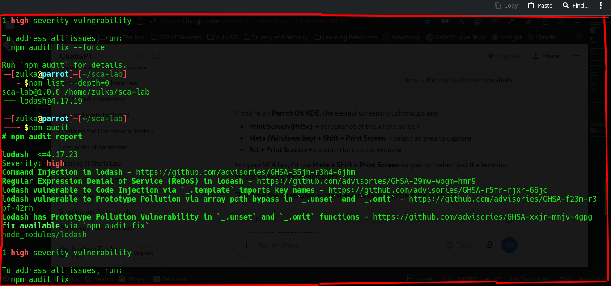
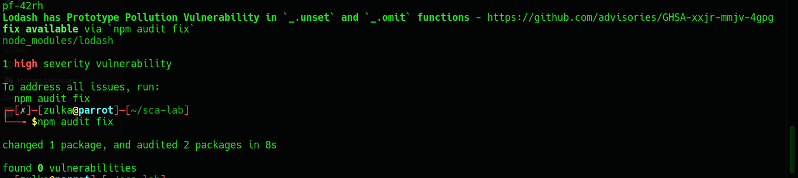

# Software Composition Analysis (SCA) Lab

## Overview

This lab demonstrates how Software Composition Analysis (SCA) can be used to identify and remediate vulnerabilities in third-party/open-source dependencies.

The lab uses a Node.js project and the npm package manager.

## Objectives

* Understand what Software Composition Analysis is
* Identify third-party dependencies
* Inspect the dependency tree
* Detect known vulnerabilities
* Analyze security advisories
* Remediate vulnerable dependencies
* Verify that vulnerabilities have been resolved

## Environment

* OS: Parrot OS
* Runtime: Node.js
* Package Manager: npm
* SCA Tool: npm audit

## Lab Setup

A new Node.js project was initialized:

```bash
npm init -y
```

Lodash was intentionally installed at an outdated version for testing:

```bash
npm install lodash@4.17.19
```

The dependency tree was inspected with:

```bash
npm list --depth=0
```

## Vulnerability Detection

The following command was used to scan the project's dependencies:

```bash
npm audit
```

The scan identified multiple known vulnerabilities affecting Lodash.

### Findings

**Package:** lodash
**Installed Version:** 4.17.19
**Severity:** High

The audit identified vulnerabilities including:

* Command Injection
* Regular Expression Denial of Service (ReDoS)
* Code Injection
* Prototype Pollution

The vulnerabilities were associated with outdated versions of Lodash.

## Remediation

npm reported that a fix was available.

The dependency was remediated using:

```bash
npm audit fix
```

The dependency was then checked again:

```bash
npm list --depth=0
```

Finally, the project was rescanned:

```bash
npm audit
```

## Verification

The final audit was used to verify whether the known vulnerabilities had been resolved.

### Before

```text
lodash@4.17.19
        ↓
npm audit
        ↓
High-severity vulnerabilities detected
```

### After

```text
Updated dependency
        ↓
npm audit
        ↓
Vulnerabilities remediated
```

## Key Security Lesson

Software dependencies introduce supply-chain risk into applications.

An application can contain vulnerabilities even when the developer did not write the vulnerable code themselves. SCA helps security and development teams identify vulnerable dependencies so they can be investigated and remediated.

## What I Learned

* How npm manages project dependencies
* How dependency trees work
* How `npm audit` identifies known vulnerabilities
* How vulnerable third-party packages can introduce application security risks
* How dependency remediation works
* The importance of continuously monitoring open-source dependencies

## Disclaimer

This project was created strictly for educational and security-learning purposes using an intentionally outdated dependency in a controlled local environment.
## Evidence

### Before Remediation



### After Remediation


